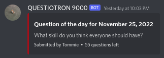

# Perl QoTD bot for Discord

Pulls random questions from a database and posts them using Discord webhooks.

## Misc info
Requires `DBI` and `WebService::Discord::Webhook`. Find the `$url` var and change it to have your webhook URL. Run periodically using a cron script or similar. Has been tested on the following operating systems:
- Fedora (36, 37)
- Rocky Linux (9)

Please open an issue if you've successfully run it on other operating systems and they'll be added.

## Database info
Create a database from the included 'questions.sql' file.

- **id**: numerical question ID, autoincrements, don't touch this
- **question**: actual question text
- **source**: intended to be used for the name of whoever submitted the question, but can be easily altered to display e.g. the website a question was fetched from
- **used**: indicates whether a question has been used or not, indended to be either '0' for unused or '1' for used but can be other numbers if you need (i.e. '2' which you assign to questions you want to use but not right now, and you have another tool that will switch them over to '0' at a specified time)
- **when**: Unix timestamp indicating when the question was used, just for reference

By default expects a database named `questions.sqlite`. Has only been tested with SQLite but should theoretically work with other database formats that DBI supports?
